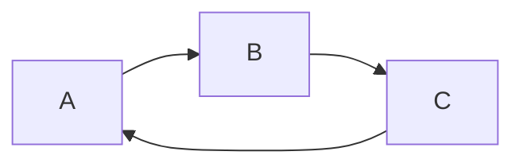
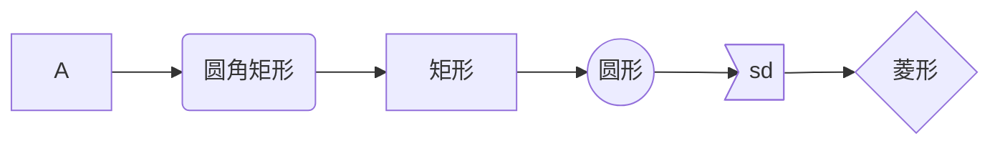
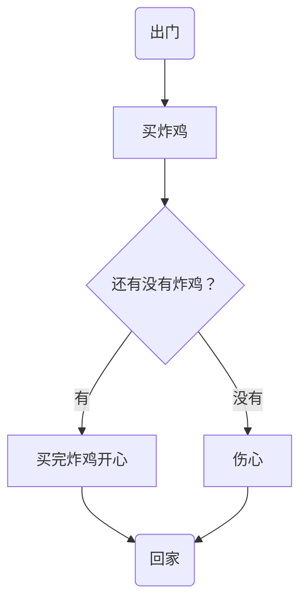
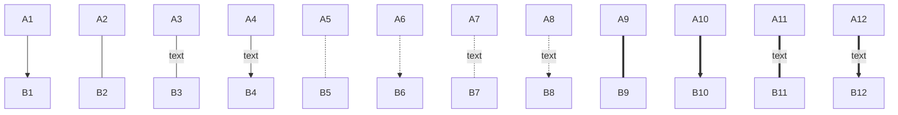
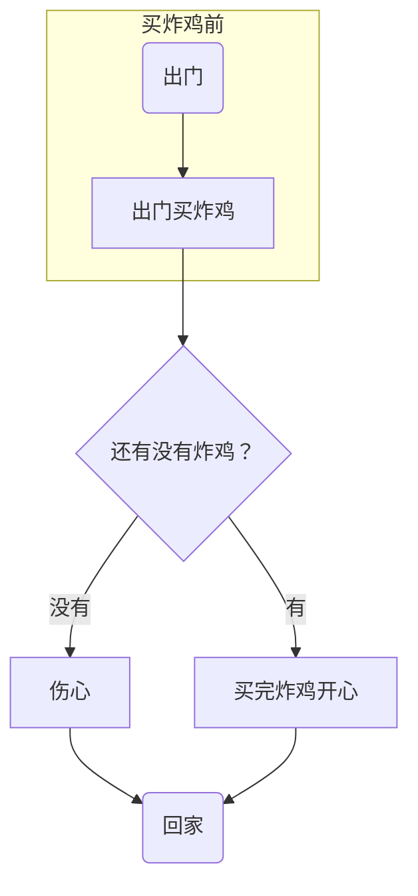

# 测试

## 测试

### 测试

#### 测试

```	java
sudo apt install

git
```

` sudo apt install git` 

```java
void test 
  sudo apt install 
```

```shell
sudo apt install git
sudo apt 
class 
```

***

---

[帮助文档](http://www.baidu.com)

[我想跳转](#测试)

<http://www.baidu.com>


graph LR; 

​	 A-->B  

​	B-->C  

​	C-->A

Graph LR;












```mermaid
sequenceDiagram
    participant 99 as 救救
    participant seller as 炸鸡店小哥
   
    99 ->> seller: 还有炸鸡吗？
    seller -->> 99: 没有，要现炸。
    99 ->> +seller:给我炸！
    loop 三分钟一次
        99 ->> seller : 我的炸鸡好了吗？
        seller -->> 99 : 正在炸
    end
    seller -->> -99: 您的炸鸡好了！

```


```mermaid
sequenceDiagram    
    participant 99 as 救救
    participant seller as 炸鸡店小哥
    99 ->> seller : 现在就多少只炸好的炸鸡？
    seller -->> 99 : 可卖的炸鸡数
    
    alt 可卖的炸鸡数 > 3
        99 ->> seller : 买三只！
    else 1 < 可卖的炸鸡数 < 3
        99 ->> seller : 有多少买多少
    else 可卖的炸鸡数 < 1
        99 ->> seller : 那我明天再来
    end

    seller -->> 99 : 欢迎下次光临

```


